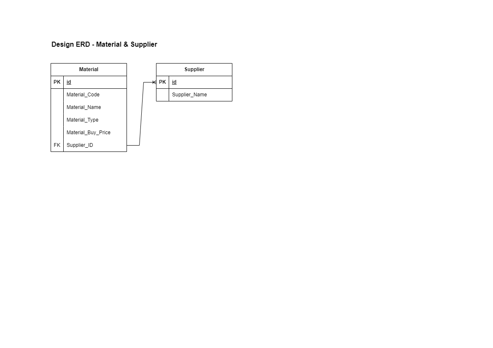

### Odoo 14 Material Registration Module

This Odoo 14 module is designed to fulfill the client's requirement for registering materials intended for sale. The module provides a user-friendly interface for managing material information efficiently. Below is an overview of the module's features and implementation:

#### Features:

1. **Material Registration:**

    - Register materials with essential information such as Material Code, Name, Type, Buy Price, and Related Supplier.
    - Material Type is selectable from a dropdown list with options: Fabric, Jeans, Cotton.
    - Buy Price validation ensures that the value is not less than 100.

2. **Material Management:**
    - View all registered materials.
    - Filter materials based on Material Type.
    - Update existing material information.
    - Delete materials as needed.

#### Implementation Details:

1. **Entity Relationship Diagram (ERD):**

    - Visual representation of the database schema showing the relationships between different entities.
      

2. **Models:**

    - Implemented models in Odoo 14 to represent the necessary entities such as Material and Supplier.
    - Fields corresponding to the required information (Material Code, Name, Type, Buy Price, and Supplier).

3. **Controllers (REST API):**

    - Developed controllers to expose RESTful endpoints for interacting with the module.
    - Endpoints for material registration, retrieval, update, and deletion.

4. **Unit Testing:**
    - Comprehensive unit tests ensure the functionality and integrity of the module.

#### How to Use:

1. **Installation:**

    - Install the module in your Odoo 14 instance.

2. **Accessing the Module:**

    - Navigate to the Material Registration section in Odoo.
    - Use the user-friendly interface to register, view, update, and delete materials.

3. **REST API Usage:**
    - Utilize the provided REST API endpoints for seamless integration with other systems.
4. **Unit Testing:**
    - Execute unit tests to validate the functionality of the module.
    - Ensure that all tests pass before deploying the module in a production environment.

#### Conclusion:

The Odoo 14 Material Registration Module offers a robust solution for managing material information effectively. With its intuitive interface, RESTful API support, and rigorous testing, it meets the client's requirements while ensuring reliability and security. Simplify your material management process with this feature-rich module.
